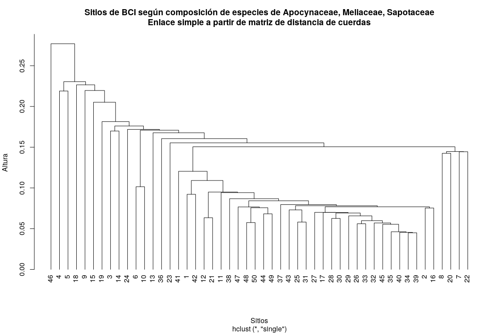
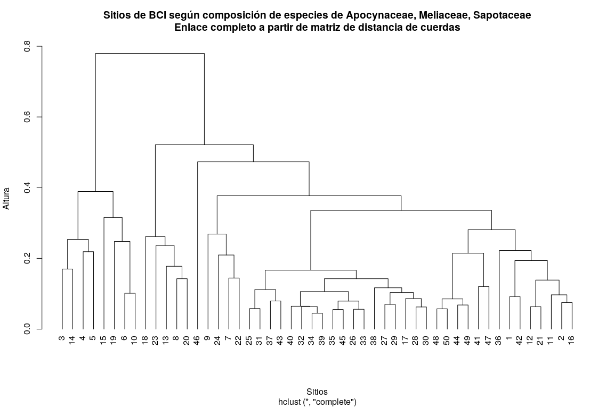
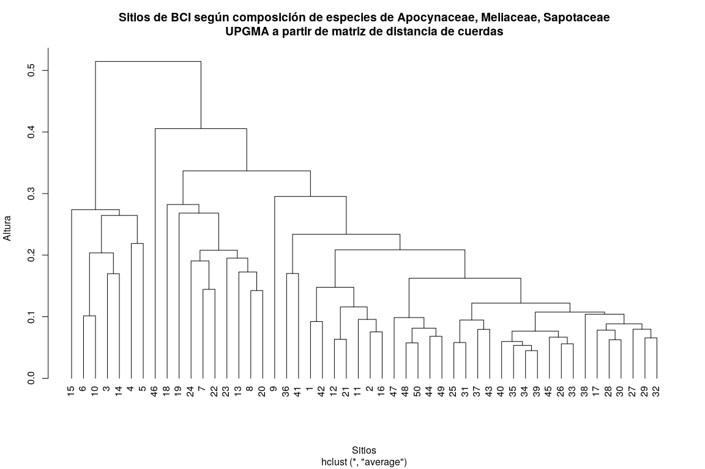
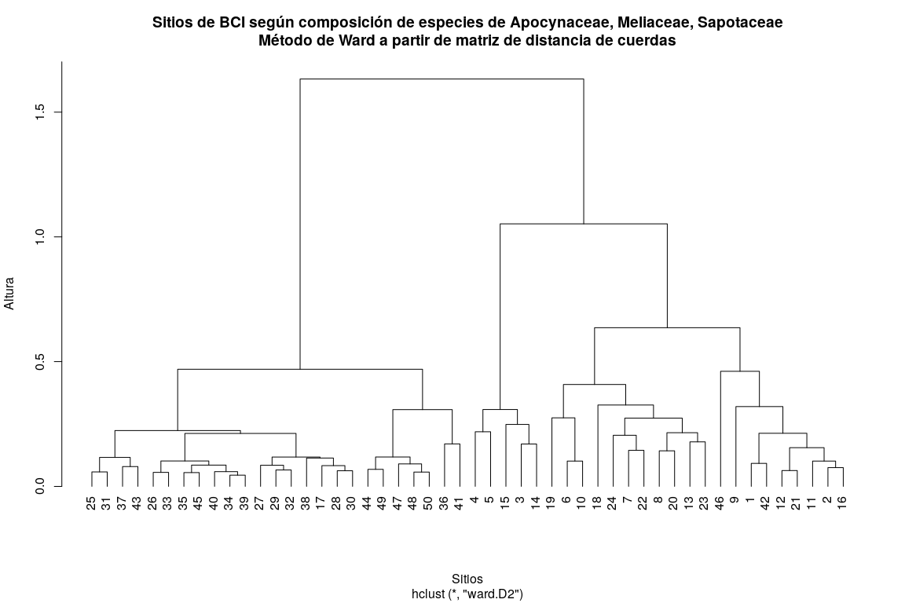

Análisis de agrupamiento (cluster analysis). <br> Parte 1: agrupamiento
jerárquico
================
JR
11 de noviembre, 2020

``` r
knitr::opts_chunk$set(fig.width=12, fig.height=8)
```

## Preámbulo

### Cargar paquetes

``` r
library(vegan)
```

    ## Loading required package: permute

    ## Loading required package: lattice

    ## This is vegan 2.5-6

``` r
library(magrittr)
library(broom)
source('biodata/funciones.R')
```

### Cargar datos

``` r
load('biodata/Apocynaceae-Meliaceae-Sapotaceae.Rdata')
mi_fam <- mc_apcyn_melic_saptc
```

## Características de las técnicas de agrupamiento

Las técnicas de agrupamiento se clasifican según los algoritmos que
emplean y el orden de ejecución, así como según el tipo de enfoque
inferencial. Los algoritmos de agrupamiento pueden ser:

  - Secuenciales o simultáneos.
  - Por aglomeración o por división. En referencias en español
    encontrarás “aglomerativos” y “divisivos”, pero ten presente que la
    primera grafía no está en el Diccionario.
  - Monotéticos o politéticos.
  - Jerárquicos o no jerárquicos.
  - Probabilísticos o no probabilísticos.
  - Restringidos o no restringidos.

## Agrupamiento jerárquico

El agrupamiento jerárquico (AJ) es una técnica de agrupamiento
secuencial que consiste en la repetición de un procedimiento dado para
agrupar objetos hasta que todos encuentran un lugar. **Los resultados
del AJ comúnmente se muestran en dendrogramas**.

Dentro del AJ es frecuente usar un enfoque aglomerativo, lo cual implica
aplicar algoritmos secuenciales desde abajo hacia arriba. Bajo este
enfoque, se comienza con una colección discontinua de objetos que son
subsecuentemente agrupados en grupos (clusters) cada vez más grandes,
hasta alcanzar un único grupo que engloba a todos los subgrupos.

El AJ aglomerativo dispone de varios algoritmos de resolución del
agrupamiento por pares, que son los denominados **“criterios de
enlace”**. Los más usados son: “de enlace simple”, “de enlace
completo” y “de enlace promedio”.

Normalmente, en el análisis de agrupamiento nos interesa agrupar sitios
en función de sus descriptores que, en una matriz de comunidad, son sus
especies, y en una matriz ambiental son las variables que caracterizan
los microhábitats. En mi caso y en el de ustedes, los sitios son los 50
cuadros de 1 Ha (quadrats); el resultado de este primer script serán
dendrogramas con los que podremos explorar, de manera visual y
analítica, cuántos grupos hacen sentido y, con suerte, determinar a qué
grupo parece pertenecer cada sitio (siguiente script).

Dado que los cuadros en BCI están autocorrelacionados espacialmente,
violamos el supuesto de independencia de las observaciones. Esto limita
el alcance de nuestros resultados, pero no los invalida, y al mismo
tiempo nos ofrecen una oportunidad estupenda para evaluar las técnicas
mostradas a continuación.

### Agrupamiento “aglomerativo” por enlace simple

Este método utiliza, como criterio de enlace para agrupar sucesivamente
pares de objetos, la mayor similaridad (“mínima distancia” o “vecino más
próximo”). Comúnmente, los dendrogramas muestran un encadenamiento de
objetos, a modo de escaleras.

Para aplicar este método, debes transformar la matriz de comunidad
utilizando alguno de los métodos explicados en medición de la
asociación. En este caso, utilizaré el método de normalización y luego
obtendré la distancia euclidea (distancia de cuerdas o *chord*).

``` r
mi_fam_norm <- decostand(mi_fam, "normalize")
mi_fam_norm_d <- vegdist(mi_fam_norm, "euc")
mi_fam_norm_d %>% tidy
```

    ## # A tibble: 1,225 x 3
    ##    item1 item2 distance
    ##    <int> <int>    <dbl>
    ##  1     2     1    0.109
    ##  2     3     1    0.468
    ##  3     4     1    0.448
    ##  4     5     1    0.538
    ##  5     6     1    0.324
    ##  6     7     1    0.230
    ##  7     8     1    0.189
    ##  8     9     1    0.247
    ##  9    10     1    0.295
    ## 10    11     1    0.150
    ## # … with 1,215 more rows

Es importante, para garantizar consistencia a lo largo del agrupamiento,
asignar los nombres de sitios al atributo `labels` del objeto de
distancias.

``` r
attr(mi_fam_norm_d, "labels") <- rownames(mi_fam)
```

Posteriormente, el agrupamiento jerárquico lo realizaré con la función
`hclust` del paquete `stats` (se carga por defecto al abrir R),
especificando el argumento `method = 'single'`:

``` r
(cl_single <- hclust(mi_fam_norm_d, method = 'single'))
```

    ## 
    ## Call:
    ## hclust(d = mi_fam_norm_d, method = "single")
    ## 
    ## Cluster method   : single 
    ## Distance         : euclidean 
    ## Number of objects: 50

Finalmente, el dendrograma a continuación:

``` r
plot(cl_single, labels = rownames(mi_fam), hang = -1,
     main = "Sitios de BCI según composición de especies de Apocynaceae, Meliaceae, Sapotaceae\nEnlace simple a partir de matriz de distancia de cuerdas",
     xlab = 'Sitios', ylab = 'Altura')
```

<!-- -->

### Agrupamiento “aglomerativo” por enlace completo

En este caso, el criterio de enlace para agrupar sucesivamente pares de
objetos es la menor similaridad (“máxima distancia” o “vecino más
lejano”). Crearé el dendrograma a partir de la misma matriz de
distancia de cuerdas empleada en el dendrograma anterior.

``` r
(cl_complete <- hclust(mi_fam_norm_d, method = 'complete'))
```

    ## 
    ## Call:
    ## hclust(d = mi_fam_norm_d, method = "complete")
    ## 
    ## Cluster method   : complete 
    ## Distance         : euclidean 
    ## Number of objects: 50

``` r
plot(cl_complete, labels = rownames(mi_fam),
     main = "Sitios de BCI según composición de especies de Apocynaceae, Meliaceae, Sapotaceae\nEnlace completo a partir de matriz de distancia de cuerdas",
     xlab = 'Sitios', ylab = 'Altura')
```

<!-- -->

### Agrupamiento “aglomerativo” por enlace promedio

En este caso, el criterio de enlace para agrupar sucesivamente pares de
objetos es el promedio entre grupos, el cual a su vez puede ser de dos
tipos: media o centroide. Este método es más bien una familia de
submétodos, clasificados en función del tipo de promedio empleado y el
peso asignado a las distancias originales (número de elementos de los
clusters que se agrupan progresivamente).

Así, dependiendo de si se media o centroide, o si se ponderan o no las
distancias originales, se producen cuatro combinaciones de submétodos:
grupos de pares no ponderados con media aritmética (unweighted
pair-group method using arithmetic averages, UPGMA), grupos de pares
ponderados con media aritmética (WPGMA), grupos de pares no ponderados
con centroide (UPGMC) y grupos de pares ponderados con centroide
(WPGMC). El más usado es UPGMA, porque máximiza la correlación entre la
distancia cofenética (ver siguiente script) y la matriz de distancia
original.

Sólo crearé el dendrograma del método UPGMA.

``` r
(cl_upgma <- hclust(mi_fam_norm_d, method = 'average'))
```

    ## 
    ## Call:
    ## hclust(d = mi_fam_norm_d, method = "average")
    ## 
    ## Cluster method   : average 
    ## Distance         : euclidean 
    ## Number of objects: 50

``` r
plot(cl_upgma, labels = rownames(mi_fam),
     main = "Sitios de BCI según composición de especies de Apocynaceae, Meliaceae, Sapotaceae\nUPGMA a partir de matriz de distancia de cuerdas",
     xlab = 'Sitios', ylab = 'Altura')
```

<!-- -->

### Agrupamiento por el método de Ward de varianza mínima

Se basa en los mismos supuestos y criterios de la regresión lineal por
mínimos cuadrados, similar a lo establecido para el ANOVA, que a fin de
cuentas es un caso particular de regresión lineal. El objetivo es
definir grupos de manera que la suma de cuadrados se minimice dentro de
cada uno de ellos.

``` r
(cl_ward <- hclust(mi_fam_norm_d, method = 'ward.D2'))
```

    ## 
    ## Call:
    ## hclust(d = mi_fam_norm_d, method = "ward.D2")
    ## 
    ## Cluster method   : ward.D2 
    ## Distance         : euclidean 
    ## Number of objects: 50

``` r
plot(cl_ward, labels = rownames(mi_fam),
     main = "Sitios de BCI según composición de especies de Apocynaceae, Meliaceae, Sapotaceae\nMétodo de Ward a partir de matriz de distancia de cuerdas",
     xlab = 'Sitios', ylab = 'Altura')
```

<!-- -->
