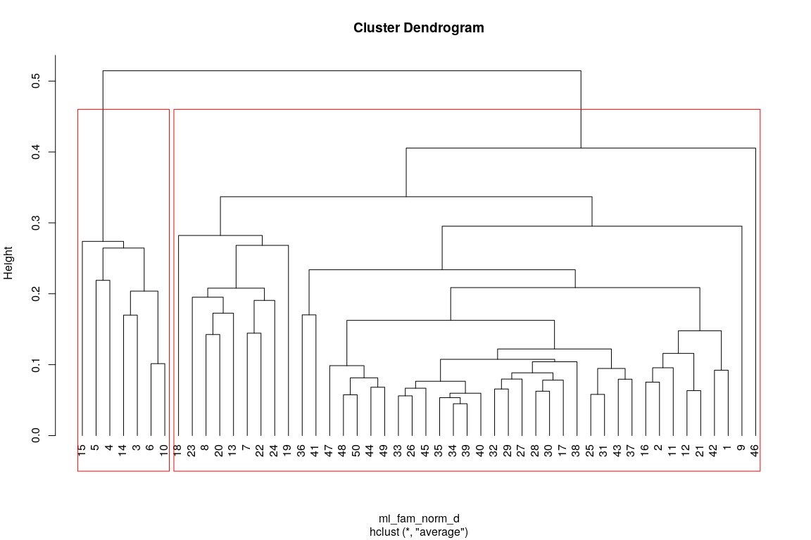
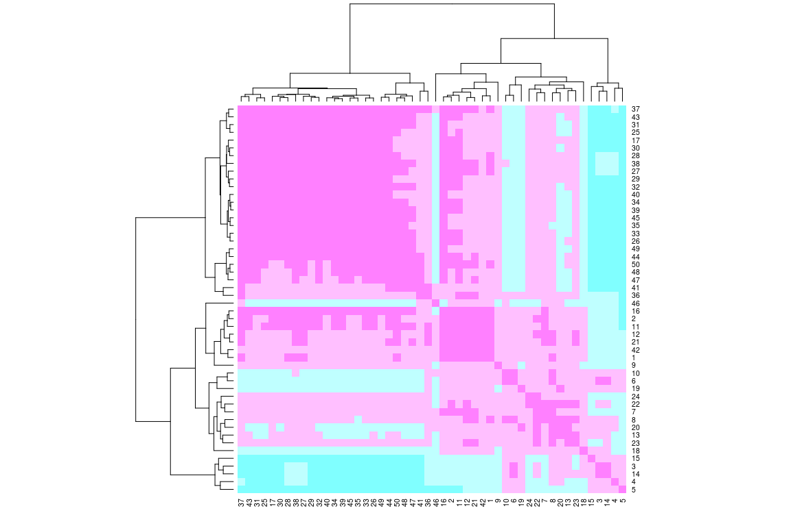
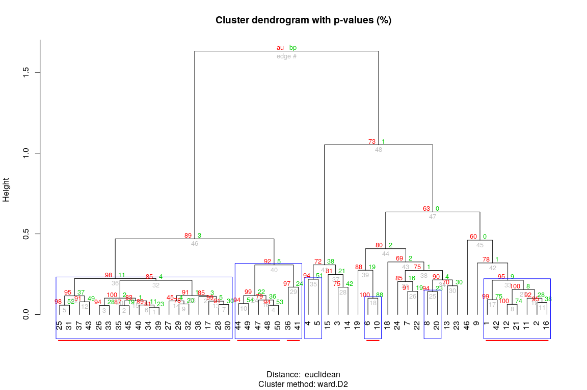

Análisis de agrupamiento (cluster analysis). <br> Parte 2:
Interpretación y comparación de resultados
================
JR
11 de noviembre, 2020

``` r
knitr::opts_chunk$set(fig.width=12, fig.height=8)
```

## Preámbulo

### Cargar paquetes

``` r
library(vegan)
```

    ## Loading required package: permute

    ## Loading required package: lattice

    ## This is vegan 2.5-6

``` r
library(tidyverse)
```

    ## ── Attaching packages ────────────────────────────────────── tidyverse 1.2.1 ──

    ## ✓ ggplot2 3.3.2     ✓ purrr   0.3.4
    ## ✓ tibble  3.0.3     ✓ dplyr   0.8.3
    ## ✓ tidyr   1.0.0     ✓ stringr 1.4.0
    ## ✓ readr   1.3.1     ✓ forcats 0.4.0

    ## ── Conflicts ───────────────────────────────────────── tidyverse_conflicts() ──
    ## x dplyr::filter() masks stats::filter()
    ## x dplyr::lag()    masks stats::lag()

``` r
library(broom)
library(cluster)
library(gclus)
```

    ## Registered S3 method overwritten by 'gclus':
    ##   method         from 
    ##   reorder.hclust vegan

``` r
library(pvclust)
source('biodata/funciones.R')
```

### Cargar datos

``` r
load('biodata/Apocynaceae-Meliaceae-Sapotaceae.Rdata')
mi_fam <- mc_apcyn_melic_saptc
```

### Generar matriz de distancias de cuerdas

``` r
mi_fam_norm <- decostand(mi_fam, "normalize")
mi_fam_norm_d <- vegdist(mi_fam_norm, "euc")
mi_fam_norm_d %>% tidy
```

    ## # A tibble: 1,225 x 3
    ##    item1 item2 distance
    ##    <int> <int>    <dbl>
    ##  1     2     1    0.109
    ##  2     3     1    0.468
    ##  3     4     1    0.448
    ##  4     5     1    0.538
    ##  5     6     1    0.324
    ##  6     7     1    0.230
    ##  7     8     1    0.189
    ##  8     9     1    0.247
    ##  9    10     1    0.295
    ## 10    11     1    0.150
    ## # … with 1,215 more rows

## Interpretación visual de dendrogramas

[En el script anterior](aa_analisis_de_agrupamiento_1_jerarquico.md)
realicé los dendrogramas a partir de una matriz de cuerdas aplicando
distintos métodos. El objetivo de este script es mostrarte cómo
explorar, de manera visual y analítica, cuál o cuáles métodos de
agrupamiento son ideales, cuántos grupos hacen sentido y, con suerte,
determinar a qué grupo parece pertenecer cada sitio.

La primera evaluación de los dendrogramas NO debe venir de la mano de
sofisticados análisis ni de procedimientos mecánicos. Te recomiendo que
los explores visualmente, con la intención de identificar grupos
(clústers) consistentes, es decir, aquellos que se repiten entre
dendrogramas. Asimismo, identifica aquellos elementos que, de manera
consistente entre dendrogramas, no parezcan agruparse con otros.

Evita concentrar tu vista en grupos extremadamente pequeños; comienza
analizando el árbol desde arriba hacia abajo, prefiere encontrar grupos
grandes y consistentes entre dendrogramas (si los hay). No atomices el
dendrograma a menos que sea estrictamente necesario. Observar muchos
grupos pequeños te impedirá ver los posibles patrones globales. Ahora
bien, si hubiere grupos pequeños reiteradamente, entonces considéralos.
No obstante, los cuadros de 1 Ha de la parcela de BCI están
autocorrelacionados espacialmente, por lo que normalmente encontrarás
grupos grandes.

Anota tus impresiones, para que las compares con los resultados que
posteriormente obtendrás; si confirmas patrones detectados visualmente,
la evidencia se irá acumulando en una dirección. Si por el contrario,
detectas inconsistencia, es el momento de revisar los scripts de
generación de dendrogramas; si luego de revisar ves que todo está
correcto, entonces debes seguir explorando patrones con otras técnicas o
utilizando distintos criterios de agrupamiento. Cuando termines la
exploración visual, entonces continúa aplicando otras técnicas
analíticas.

Para la exploración visual, generaré los objetos de cluster dentro de
una lista:

``` r
lista_cl <- list(
        cl_single = hclust(mi_fam_norm_d, method = 'single'),
        cl_complete = hclust(mi_fam_norm_d, method = 'complete'),
        cl_upgma = hclust(mi_fam_norm_d, method = 'average'),
        cl_ward = hclust(mi_fam_norm_d, method = 'ward.D2')
)
```

Un plot en panel 2x2 ayuda a visualizarlos todos de manera conjunta. En
tu caso, observa y compara todos los dendrogramas:

``` r
par(mfrow = c(2,2))
invisible(map(names(lista_cl), function(x) plot(lista_cl[[x]], main = x, hang = -1)))
```

<!-- -->

``` r
par(mfrow = c(1,1))
```

En mi caso, exceptuando el dendrograma generado por medio del enlace
simple, detecto al menos 2 grupos consistentes (integrados por múltiples
posibles subgrupos), los cuales mencionaré usando los identificadores de
sitios:

  - Un grupo pequeño, compuesto por los sitios 1, 42, 12, 21, 11, 2 y
    16.
  - Un “grupo” heterogéneo y grande, conformado por 25, 31,…, 26,…,
    35,…, 34,…,32, 17,…, 30, que también parece incluir a 44, 49, 47,
    48, 50.

Además de los grupos anteriores, detecto elementos que no forman grupos,
es decir, sitios que aparecen aislados del resto, como por ejemplo el 46
y, en algunos métodos, también el 9.

## Elegir método y número de clústers

Existen varios criterios para elegir un dendrograma idóneo, como por
ejemplo, los gráficos tipo-Shepard y la correlación cofenética. Centraré
mi atención en esta última. Igualmente, una vez elijas el método de
agrupamiento idóneo, existen varios métodos para decidir cuántos
clústers son óptimos, como la anchura de silueta (*silhouette width*) y
los niveles de fusión (*fusion levels*).

### Seleccionar método de agrupamiento por correlación cofenética

La correlación cofenética impica conocer la distancia cofenética, y esta
última se entiende mejor con un ejemplo: elige un objeto (e.g. sitio,
cuadro de 1 ha) cualquiera, “escala” por el árbol hasta llegar a un
nodo, luego desciende hasta el objeto más cercano. El recorrido que
acabas de realizar se denomina distancia cofenética. Ahora,
hipotéticamente, construye una matriz de distancias cofenéticas entre
todos los objetos (a pares), y calcula la correlación de ésta con la
matriz de distancias original. Esto último se denomina “correlación
cofenética”. El método con el valor más alto de correlación cofenética
es el que mejor sintetiza la distancia original y, por lo tanto, será el
preferido. Normalmente, la mayor correlación cofenética la brindan UPGMA
y enlace completo, pero no elijas un método de agrupamiento
mecánicamente basándote sólo en este criterio (ver notas más adelante
al respecto).

Usando la lista de objetos de clústers, calcularé la correlación
cofenética dentro de un `map`, para así repetir el mismo proceso con
los cuatro objetos de clusters en una sentencia:

``` r
map_df(lista_cl, function(x) {
        coph_d <- cophenetic(x)
        corr <- cor(mi_fam_norm_d, coph_d)
        return(corr)
})
```

    ## # A tibble: 1 x 4
    ##   cl_single cl_complete cl_upgma cl_ward
    ##       <dbl>       <dbl>    <dbl>   <dbl>
    ## 1     0.748       0.853    0.864   0.591

Habrás notado que, tanto UPGMA como enlace completo, tienen valores
altos de correlación cofenética. Un método complementario para explorar
la correlación cofenética es el diagrama tipo-Shepard, el cual te
recomiendo aprender a usar por tu cuenta si quieres profundizar.

### Elegir número de clústers

Elegiré UPGMA como método de agrupamiento y determinaré cuántos grupos
son idóneos de acuerdo a su anchura de silueta (*silhouette width*). Sin
embargo, no lo haré sólo para UPGMA, también contrastaré con Ward. ¿Por
qué? De entrada, se sabe que UPGMA tendrá una buena correlación
cofenética, dado que dicho método está diseñado para maximizarla. Sin
embargo, me interesa explorar patrones con sentido ecológico, no sólo
seguir procedimientos mecánicos y, al menos en mi caso, el método de
Ward podría hacer más sentido ecológico que UPGMA.

El objetivo de la función `calcular_anchuras_siluetas` está implícito en
su nombre. Esta función requiere de tres argumentos: matriz de comunidad
original, matriz de distancias, y objeto de clúster. Las anchuras
promedio las calculará para todas las posibles particiones, excepto para
la partición `i=1` y `i=50`, por ser irrelevantes (se les asigna 0).

Para UPGMA:

``` r
anch_sil_upgma <- calcular_anchuras_siluetas(
        mc_orig = mi_fam, 
        distancias = mi_fam_norm_d, 
        cluster = lista_cl$cl_upgma)
anch_sil_upgma
```

    ## $anchuras_siluetas
    ##  [1] 0.000000000 0.497227058 0.397814274 0.393315605 0.347610203
    ##  [6] 0.330190712 0.303411977 0.291446886 0.303415560 0.239076155
    ## [11] 0.233416290 0.253256540 0.259056163 0.267689186 0.260757138
    ## [16] 0.260662924 0.260521122 0.237214739 0.230326945 0.229999688
    ## [21] 0.221928608 0.214698947 0.210398081 0.178850174 0.175547500
    ## [26] 0.181202540 0.165788087 0.149195806 0.131454456 0.126864825
    ## [31] 0.127717891 0.115800245 0.112221448 0.109183092 0.094229092
    ## [36] 0.084743801 0.083949119 0.084009561 0.078643048 0.071445497
    ## [41] 0.060323782 0.049604701 0.035098668 0.031101489 0.028658135
    ## [46] 0.018498894 0.008694614 0.002622854 0.004898513 0.000000000
    ## 
    ## $n_grupos_optimo
    ## [1] 2

El objeto `anchuras_siluetas` de la lista `anch_sil_upgma` te muestra un
vector con los promedios de anchuras de siluetas para todas las posibles
particiones con sentido.

Igualmente, el objeto `n_grupos_optimo` te indica cuál es el número
óptimo de clústers a crear, es decir, en cuántos grupos cortar el
árbol. Esto se determina programáticamente por medio de la posición que
ocupa el promedio más alto, que en este caso es dos. Sin embargo, te
recomiendo NO usar este número a ciegas. Verifica si el valor máximo,
que en este caso ocupa la posición dos, se diferencia mucho de los de su
entorno, por ejemplo, del de la posición 3. Tal es mi caso: el valor de
anchura promedio de la posición 2 se diferencia, por mucho, del de la
posición 3. Por lo tanto, puedo elegir con seguridad 2 como número de
clústers óptimo:

``` r
u_dend_reord <- reorder.hclust(lista_cl$cl_upgma, mi_fam_norm_d)
plot(u_dend_reord, hang = -1)
rect.hclust(
        tree = u_dend_reord,
        k = anch_sil_upgma$n_grupos_optimo)
```

<!-- -->

Comparando el dendrograma con el mapa de calor. Verificar si el número
de grupos hace sentido

``` r
heatmap(
        as.matrix(mi_fam_norm_d),
        Rowv = as.dendrogram(u_dend_reord),
        symm = TRUE,
        margin = c(3, 3),
        col = rev(cm.colors(4))
)
```

<!-- -->

Para Ward:

``` r
anch_sil_ward <- calcular_anchuras_siluetas(
        mc_orig = mi_fam, 
        distancias = mi_fam_norm_d, 
        cluster = lista_cl$cl_ward)
anch_sil_ward
```

    ## $anchuras_siluetas
    ##  [1] 0.000000000 0.359197472 0.342844912 0.295971460 0.263445050
    ##  [6] 0.267884590 0.254649875 0.253608144 0.255010585 0.255155829
    ## [11] 0.250948411 0.251427670 0.258660249 0.256709221 0.215305926
    ## [16] 0.211603141 0.211371472 0.204996675 0.205765930 0.207873704
    ## [21] 0.204980862 0.198216814 0.191329020 0.191387386 0.185503406
    ## [26] 0.181202540 0.156471190 0.142669155 0.146490679 0.146229943
    ## [31] 0.140554256 0.136183014 0.119590733 0.107673087 0.105295130
    ## [36] 0.096251438 0.089625148 0.089694555 0.080209263 0.074842750
    ## [41] 0.067645199 0.060795323 0.046289289 0.042292110 0.036925808
    ## [46] 0.026766568 0.016962288 0.005944595 0.004898513 0.000000000
    ## 
    ## $n_grupos_optimo
    ## [1] 2

En este caso, el valor máximo, que ocupa la posición número 2, no se
diferencia mucho del de la posición 3. Al parecer, sería igualmente
válido elegir 2 o 3 particiones, por tener promedios de anchuras de
siluetas bastante parecidos. Por tal razón, cortaré el dendrograma en 2
y en 3 grupos, respectivamente:

``` r
w_dend_reord <- reorder.hclust(lista_cl$cl_ward, mi_fam_norm_d)
plot(w_dend_reord, hang = -1)
rect.hclust(
        tree = w_dend_reord,
        k = anch_sil_ward$n_grupos_optimo)
```

<!-- -->

``` r
plot(w_dend_reord)
rect.hclust(
        tree = w_dend_reord,
        k = anch_sil_ward$n_grupos_optimo + 1)
```

<!-- -->

Comparando el dendrograma con el mapa de calor. Verificar si el número
de grupos hace sentido

``` r
heatmap(
        as.matrix(mi_fam_norm_d),
        Rowv = as.dendrogram(w_dend_reord),
        symm = TRUE,
        margin = c(3, 3),
        col = rev(cm.colors(4))
)
```

<!-- -->

### Validación cruzada por bootstrap multiescalar

#### Ward

``` r
set.seed(10) # En favor de la reproducibilidad
cl_pvclust_ward <-
        pvclust(t(mi_fam_norm),
                method.hclust = "ward.D2",
                method.dist = "euc",
                parallel = TRUE)
```

    ## Creating a temporary cluster...done:
    ## socket cluster with 7 nodes on host 'localhost'
    ## Multiscale bootstrap... Done.

``` r
# Añadir los valores de p
plot(cl_pvclust_ward, hang = -1)
# Añadir rectángulos a los grupos significativos
pvrect(cl_pvclust_ward, alpha = 0.95, pv = "au")
pvrect(cl_pvclust_ward, alpha = 0.91, border = 4)
```

<!-- -->

#### UPGMA

``` r
set.seed(10) # En favor de la reproducibilidad
cl_pvclust_upgma <-
        pvclust(t(mi_fam_norm),
                method.hclust = "average",
                method.dist = "euc",
                parallel = TRUE)
```

    ## Creating a temporary cluster...done:
    ## socket cluster with 7 nodes on host 'localhost'
    ## Multiscale bootstrap... Done.

``` r
# Añadir los valores de p
plot(cl_pvclust_upgma, hang = -1)
# Añadir rectángulos a los grupos significativos
pvrect(cl_pvclust_upgma, alpha = 0.95, pv = "au")
pvrect(cl_pvclust_upgma, alpha = 0.91, border = 4)
```

<!-- -->
