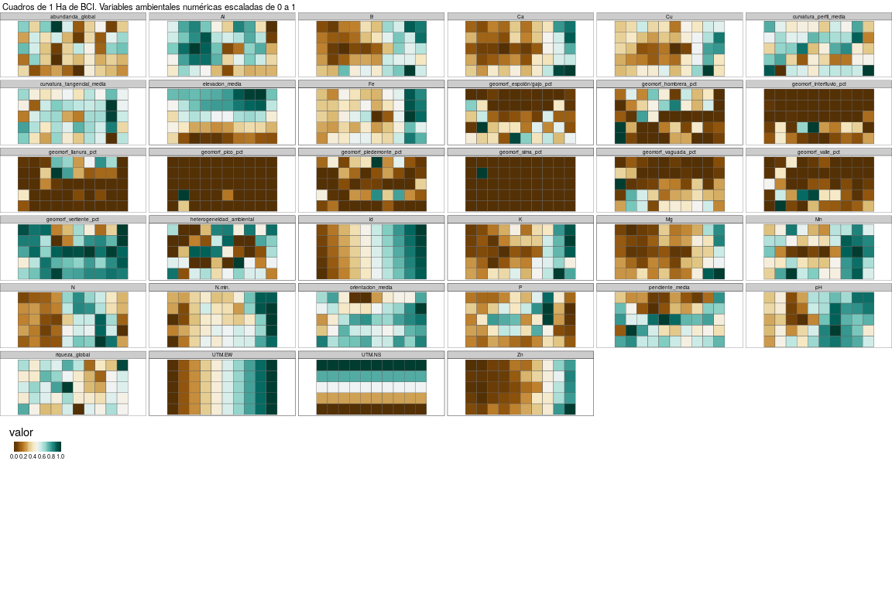
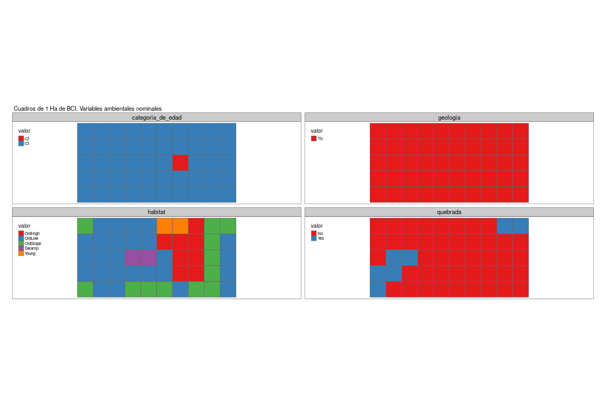

Análisis exploratorio de datos. Mapas de variables ambientales por lotes
================
JR
3 de diciembre, 2020

``` r
knitr::opts_chunk$set(fig.width=12, fig.height=8)
```

## Preámbulo

### Cargar paquetes

``` r
library(tmap)
library(sf)
```

    ## Linking to GEOS 3.6.2, GDAL 2.2.3, PROJ 4.9.3

``` r
library(tidyverse)
```

    ## ── Attaching packages ──────────────────────────────── tidyverse 1.2.1 ──

    ## ✓ ggplot2 3.3.2     ✓ purrr   0.3.4
    ## ✓ tibble  3.0.3     ✓ dplyr   0.8.3
    ## ✓ tidyr   1.0.0     ✓ stringr 1.4.0
    ## ✓ readr   1.3.1     ✓ forcats 0.4.0

    ## ── Conflicts ─────────────────────────────────── tidyverse_conflicts() ──
    ## x dplyr::filter() masks stats::filter()
    ## x dplyr::lag()    masks stats::lag()

``` r
library(RColorBrewer)
```

### Cargar datos

``` r
load('biodata/matriz_ambiental.Rdata')
```

## Convertir a KML

``` r
st_write(
  bci_env_grid %>% rename(Name = id),
  driver = 'KML',
  dsn = 'matriz_ambiental.kml',
  delete_dsn = T)
```

    ## Deleting source `matriz_ambiental.kml' using driver `KML'
    ## Writing layer `matriz_ambiental' to data source `matriz_ambiental.kml' using driver `KML'
    ## Writing 50 features with 38 fields and geometry type Polygon.

``` r
st_write(
  bci_env_grid %>% rename(Name = id) %>% st_centroid(),
  driver = 'KML',
  dsn = 'matriz_ambiental_puntos.kml',
  delete_dsn = T
)
```

    ## Warning in st_centroid.sf(.): st_centroid assumes attributes are constant
    ## over geometries of x

    ## Deleting source `matriz_ambiental_puntos.kml' using driver `KML'
    ## Writing layer `matriz_ambiental_puntos' to data source `matriz_ambiental_puntos.kml' using driver `KML'
    ## Writing 50 features with 38 fields and geometry type Point.

Uní los dos archivos anteriores en un único KML nombrado como
`mapa_cuadros_1ha_para_google_earth.kml`, el cual muestra los puntos
como rótulos identificadores de cada cuadro de 1 Ha dentro de sus
correspondientes polígonos. Visualizar dicho archivo en GoogleEarth para
un “recorrido virtual” por BCI.

## Generar mapas por lotes

### Variables ambientales numéricas con `ggplot2`

``` r
mapas_var_amb_num_gg <- bci_env_grid %>%
  select_if(is.numeric) %>% 
  gather(variable, valor, -geometry) %>% 
  group_by(variable) %>% 
  mutate(
    valor = scales::rescale(valor, to = c(0, 1)),
    id = rep(1:50)) %>% 
  ggplot +
  aes(geometry = geometry, fill = valor) +
  theme(axis.text = element_blank()) +
  geom_sf(lwd = 0.1, color = 'grey50', alpha = 0.8) + coord_sf() +
  scale_fill_gradientn(colours = brewer.pal(11, 'BrBG')) +
  geom_sf_text(aes(label = id, color = between(valor, 0.3, 0.7)), size = 1.75) +
  scale_color_manual(guide = FALSE, values = c("white", "black")) +
  facet_wrap(~ variable, ncol = 6) + 
  ggtitle('Cuadros de 1 Ha de BCI. Variables ambientales numéricas escaladas de 0 a 1')
```

    ## Warning: attributes are not identical across measure variables;
    ## they will be dropped

``` r
mapas_var_amb_num_gg
```

<!-- -->

PNG

``` r
png(
  filename = 'mapas_variables_ambientales_numericas.png',
  width = 1700, height = 1080, res = 150)
mapas_var_amb_num_gg
dev.off()
```

    ## png 
    ##   2

### Variables ambientales numéricas con `tmap`

``` r
mapas_var_amb_num_tmap <- bci_env_grid %>%
  select_if(is.numeric) %>% 
  gather(variable, valor, -geometry) %>% 
  group_by(variable) %>% 
  mutate(
    valor = scales::rescale(valor, to = c(0, 1)),
    id = rep(1:50)) %>% 
  tm_shape() +
  tm_polygons(col = 'valor',
              palette = brewer.pal(11, 'BrBG'),
              style ='cont',
              legend.is.portrait = FALSE) +
  tm_facets(by = 'variable', ncol = 6, nrow = 6) +
  tm_layout(main.title="Cuadros de 1 Ha de BCI. Variables ambientales numéricas escaladas de 0 a 1",
            main.title.size = 0.7,
            legend.outside.position="bottom",
            legend.outside=TRUE,
            legend.width = 0.2,
            legend.text.size = 0.5,
            legend.stack="horizontal", 
            outer.margins=0)
```

    ## Warning: attributes are not identical across measure variables;
    ## they will be dropped

``` r
mapas_var_amb_num_tmap
```

<!-- -->

PNG

``` r
png(
  filename = 'mapas_variables_ambientales_numericas_tmap.png',
  width = 1800, height = 1400, res = 350, pointsize = 12)
mapas_var_amb_num_tmap
dev.off()
```

    ## png 
    ##   2

### Variables ambientales nominales con `tmap`

``` r
mapas_var_amb_nom_tmap <- bci_env_grid %>%
  select_if(negate(is.numeric)) %>% 
  gather(variable, valor, -geometry) %>% 
  tm_shape() +
  tm_polygons(col = 'valor',
              palette = brewer.pal(8, 'Set1'),
              legend.show = T) +
  tm_facets(by = 'variable', ncol = 2, free.scales = T, free.coords = T) +
  tm_layout(main.title="Cuadros de 1 Ha de BCI. Variables ambientales nominales",
            main.title.size = 0.7,
            asp = 3.5,
            legend.text.size = 0.7)
```

    ## Warning: attributes are not identical across measure variables;
    ## they will be dropped

``` r
mapas_var_amb_nom_tmap
```

<!-- -->

PNG

``` r
png(
  filename = 'mapas_variables_ambientales_nominales_tmap.png',
  width = 2000, height = 1200, res = 350, pointsize = 12)
mapas_var_amb_nom_tmap
dev.off()
```

    ## png 
    ##   2
